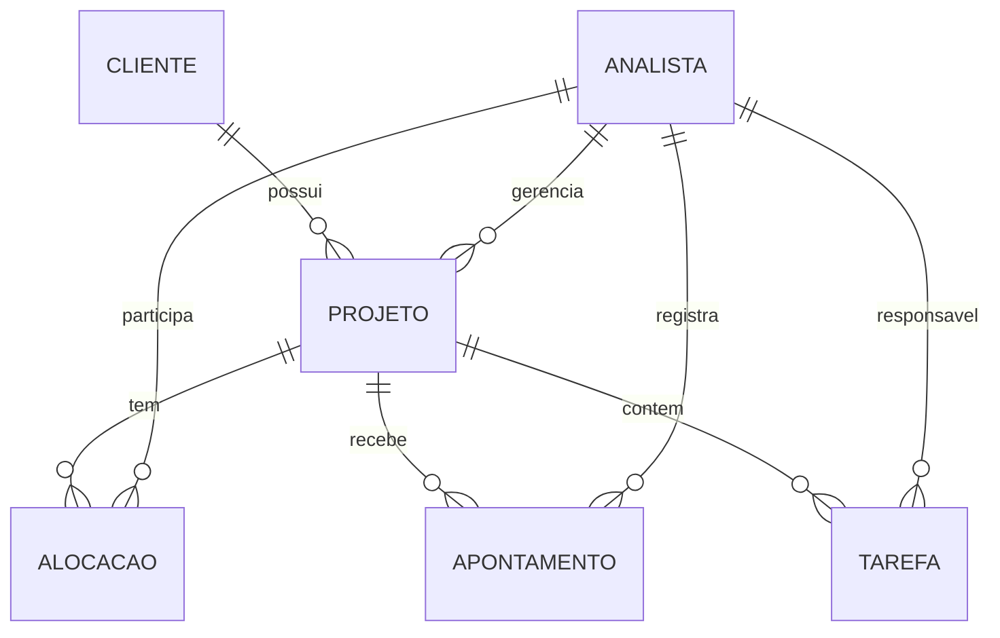
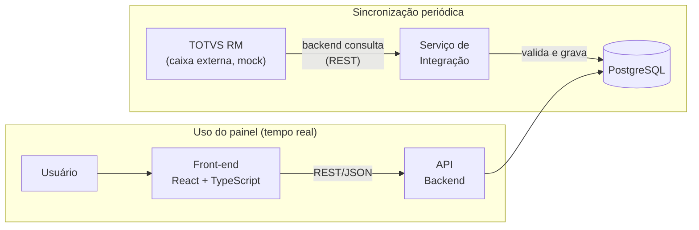

# Painel de Projetos - Case Técnico PVT

Este é o meu design técnico para o módulo "Painel de Projetos" do Portal de Gestão. O TOTVS RM é tratado como caixa externa (fonte oficial dos dados), com dados mockados, conforme o enunciado permite.

---

## 1. Modelagem do domínio

Pensei nas entidades a partir de uma pergunta: **o que o painel precisa para calcular saldo, consumo e status?** Tudo que não ajuda nesses cálculos, ficou de fora.

### Entidades

**Cliente** *(origem: RM, sincronizado)*

| Atributo | Tipo |
|---|---|
| Id | int |
| Nome | string |
| CNPJ | string |
| Ativo | bool |

**Projeto** *(origem: RM, sincronizado)*

| Atributo | Tipo |
|---|---|
| Id | int |
| ClienteId | FK → Cliente |
| GerenteId | FK → Analista |
| Nome | string |
| Descricao | string |
| HorasVendidas | decimal |
| DataInicio | date |
| Prazo | date |
| Status | enum (EmAndamento / Concluido / Cancelado) |

**Analista** *(origem: RM, sincronizado)*

| Atributo | Tipo |
|---|---|
| Id | int |
| Nome | string |
| Email | string |
| Cargo | string |
| Ativo | bool |

> Essa entidade representa qualquer colaborador da PVT, incluindo os gerentes de projeto. Mantive o nome "Analista" porque é o termo que o enunciado usa. O cargo é um atributo, para não precisar de uma entidade para cada cargo da empresa.

**Alocação** *(nasce no portal)*

| Atributo | Tipo |
|---|---|
| Id | int |
| ProjetoId | FK → Projeto |
| AnalistaId | FK → Analista |
| HorasPlanejadas | decimal |
| DataInicio | date |
| DataFim | date |

**Apontamento** *(nasce no portal)*

| Atributo | Tipo |
|---|---|
| Id | int |
| ProjetoId | FK → Projeto |
| AnalistaId | FK → Analista |
| Data | date |
| Horas | decimal |
| Descricao | string |

**Tarefa** *(nasce no portal)*

| Atributo | Tipo |
|---|---|
| Id | int |
| ProjetoId | FK → Projeto |
| AnalistaId | FK → Analista (opcional) |
| Titulo | string |
| Descricao | string |
| Status | enum (Pendente / EmAndamento / Concluida) |

### Diagrama ER



### Pontos importantes da modelagem

- **Saldo, percentuais e status não são atributos de Projeto.** São valores calculados na hora, a partir dos apontamentos e tarefas. Se eu guardasse esses valores no banco, correria o risco de ficarem desatualizados em relação aos dados reais.
- **Alocação é o plano, Apontamento é o que aconteceu.** A alocação é o coordenador escalando o analista com X horas planejadas. O apontamento é o analista registrando as horas que realmente trabalhou. Comparar os dois é parte do valor do painel.
- **Tarefa mede o escopo entregue, independente das horas.** É com ela que dá para ver se o projeto está entregando no ritmo que está gastando.

---

## 2. Arquitetura da solução

Separei a arquitetura em dois fluxos, porque eles têm naturezas diferentes:

**Fluxo 1, sincronização com o ERP:** o RM é a fonte oficial de Clientes, Projetos (com as horas vendidas) e Analistas. Um serviço de integração no backend consulta o RM de tempos em tempos (ex.: a cada 1h), valida os dados e grava no banco local. O painel **nunca** consulta o RM em tempo real. Se o ERP estiver fora do ar, o portal continua funcionando com os dados da última sincronização.

**Fluxo 2, operação do painel:** o usuário acessa a interface web (React + TypeScript), que consome a API do backend via REST/JSON. Alocações, apontamentos e tarefas nascem no próprio portal e vão direto para o banco. Esses não dependem do RM em momento nenhum.

**Banco de dados:** escolhi o PostgreSQL. É relacional (combina com o modelo de entidades), gratuito, robusto, tem bom desempenho nas consultas de agregação (somar horas por projeto é a operação mais comum do painel) e é um dos bancos citados no ambiente da PVT.

### Diagrama de fluxo



---

## 3. Design da API

API REST em JSON. Os principais recursos:

| # | Verbo + Recurso | O que faz / retorna |
|---|---|---|
| 1 | `GET /projetos` | Lista os projetos com saldo, horas consumidas, escopo entregue e status **já calculados pelo backend**. Filtros: `?status=`, `?clienteId=`, `?analistaId=` |
| 2 | `GET /projetos/{id}` | Detalhe de um projeto: dados cadastrais + métricas de saúde + alocações + últimos apontamentos |
| 3 | `GET /projetos/{id}/apontamentos` | Histórico de apontamentos do projeto |
| 4 | `POST /apontamentos` | Registra um apontamento de horas |
| 5 | `PATCH /apontamentos/{id}` | Corrige um apontamento (horas, descrição, data) |
| 6 | `DELETE /apontamentos/{id}` | Remove um apontamento registrado por engano |
| 7 | `GET /analistas/{id}/projetos` | Projetos onde o analista está alocado. É assim que ele sabe onde pode apontar |
| 8 | `POST /alocacoes` | Aloca um analista em um projeto, com as horas planejadas |
| 9 | `POST /projetos/{id}/tarefas` | Cria uma tarefa no projeto |
| 10 | `PATCH /tarefas/{id}` | Atualiza uma tarefa, principalmente concluir (o que move o escopo entregue) |

### Regras de acesso e validação

- **Só aponta quem está alocado:** o `POST /apontamentos` rejeita (HTTP 422) se o analista não tiver alocação ativa naquele projeto.
- **Cada um mexe no que é seu:** o analista só edita/exclui os próprios apontamentos. Alocações e tarefas são do coordenador/gerente.
- **Auditoria:** apontamento é dado com impacto financeiro (é a base do consumo das horas vendidas). Edições e exclusões gerariam trilha de auditoria: quem alterou, o quê e quando.
- **As métricas são calculadas no backend:** o front só exibe. Assim a regra de negócio vive em um único lugar.
- Os endpoints de escrita exigiriam autenticação com perfil adequado (coordenador × analista). Não detalhei a autenticação por escopo. Está listada como evolução na seção 6.

---

## 4. Regras de negócio

### Saldo de horas

```
Saldo = HorasVendidas − (soma das horas dos apontamentos do projeto)
```

Saldo negativo = o projeto consumiu mais do que foi vendido (estourou).

### Horas consumidas e escopo entregue

Trabalho com duas medidas, calculadas de fontes independentes. É isso que faz o painel funcionar:

**Horas consumidas (%)**: quanto das horas vendidas já foi gasto.

```
HorasConsumidas = (soma das horas apontadas ÷ HorasVendidas) × 100
```

**Escopo entregue (%)**: quanto das tarefas já foi concluído.

```
EscopoEntregue = (TarefasConcluidas ÷ TotalDeTarefas) × 100
```

### Classificação de status (saúde do projeto)

O status cruza as duas medidas. A lógica que usei: um projeto saudável consome horas no mesmo ritmo em que entrega. Quando o consumo descola da entrega, o painel acende o alerta **antes** de o saldo estourar.

Definindo `Gap = HorasConsumidas − EscopoEntregue`:

| Status | Critério |
|---|---|
| 🟢 Saudável | Gap ≤ 10 pontos **e** saldo ≥ 15% das horas vendidas |
| 🟡 Atenção | Gap entre 10 e 25 pontos, **ou** saldo < 15% das horas vendidas |
| 🔴 Crítico | Saldo negativo, **ou** Gap > 25 pontos, **ou** prazo vencido sem conclusão |

**Exemplo prático:** projeto com 100h vendidas, 95h apontadas e 8 de 10 tarefas concluídas:

- Saldo = 5h (positivo, mas só 5% do vendido)
- Horas consumidas = 95% · Escopo entregue = 80% → Gap = 15 pontos
- Status = 🟡 **Atenção**. O projeto ainda não estourou, mas faltam 20% do escopo com só 5% das horas. O painel avisa o risco antes do estouro. Olhando só o saldo, esse projeto pareceria ok.

> Os valores usados aqui (10 / 25 / 15%) são um ponto de partida. Eles ficariam em configuração, numa tabela de parâmetros ou variável de ambiente, para a coordenação ajustar esses números sem precisar de alteração em código e deploy.

---

## 5. Decisões e trade-offs

**Sincronização periódica em vez de consulta ao RM em tempo real.** Descartei a consulta em tempo real para o portal não depender da disponibilidade do ERP. Com o banco local, se o RM cair, o sistema continua funcionando com as informações que já estão locais, mesmo que defasadas, e sincroniza de novo quando o ERP voltar. O trade-off é aceitar dados com até ~1h de defasagem, o que para acompanhamento de saúde de projeto não atrapalha a decisão de ninguém.

**Valores calculados, não armazenados.** Saldo, percentuais e status são calculados na consulta, a partir dos apontamentos e tarefas. Assim não existe risco de inconsistência entre um valor gravado e a realidade dos dados. Um efeito bom dessa decisão: se as horas vendidas mudarem no RM durante uma queda longa da sincronização, basta o dado bruto atualizar que o próximo cálculo já sai certo, sem rotina de correção.

**Uma entidade de pessoa, não uma por cargo.** Cheguei a pensar em entidades separadas (Analista, Gerente...), mas descartei: toda vez que surgisse um cargo novo, o banco mudaria. Ficou a entidade `Analista` generalizada com o atributo `Cargo`. O gerente do projeto é resolvido pela FK `GerenteId` no Projeto. Como evolução, o papel poderia ir para a Alocação (enum), permitindo papéis diferentes por projeto.

**Cargo como string, não enum.** Cargo é um conjunto aberto, que muda por decisão administrativa, e nenhuma regra do painel depende dele. Um enum exigiria mexer no código e fazer deploy a cada cargo novo. Deixei os enums para os conjuntos fechados que dirigem regras de negócio: Status de Projeto e Status de Tarefa.

**Apontamento aponta direto para o Projeto (não para a Alocação).** Mantém o modelo simples e as somas diretas. A regra "só aponta quem está alocado" fica garantida por validação na API (o 422). A alternativa, uma FK do Apontamento para a Alocação, garantiria isso na estrutura do banco, mas deixaria as consultas mais indiretas. Descartei pela complexidade.

**Tarefa independente de Apontamento.** Elas medem coisas diferentes: Tarefa mede escopo entregue, Apontamento mede tempo gasto. É justamente por serem independentes que dá para cruzar as duas e detectar projeto gastando mais do que entrega. Evolução possível: um `TarefaId` opcional no Apontamento, para saber o custo de cada tarefa.

**Escopo entregue medido por tarefas concluídas.** Escolhi calcular pela proporção de tarefas concluídas porque é um dado objetivo e rastreável. A alternativa, um percentual informado manualmente pelo gerente, é mais simples e comum em consultoria, mas subjetiva. Se a granularidade de tarefas não se mostrar prática no dia a dia, o campo manual fica como alternativa.

---

## 6. Como eu evoluiria isso

### Performance (centenas de projetos, vários acessos simultâneos)

- **Paginação no `GET /projetos`:** o front recebe os projetos em páginas (ex.: 20 por vez), então a tela carrega rápido mesmo com centenas de projetos.
- **Cache do resultado calculado:** as métricas da listagem ficariam em cache por alguns minutos. Vários acessos no mesmo período leem o cache em vez de recalcular tudo. Como saúde de projeto não muda de minuto em minuto, essa defasagem não incomoda.
- **Índices nas colunas mais consultadas:** além dos índices automáticos das chaves primárias, criaria índices em `Apontamento.ProjetoId` (toda soma de horas filtra por ela, é a consulta mais frequente do sistema), `Tarefa.ProjetoId` e as demais FKs.

### Resiliência (ERP fora do ar ou lento)

- **O painel não depende do RM em tempo real** (decisão da arquitetura): se a sincronização falhar, o portal continua operando com os dados locais.
- **Transparência para o usuário:** o painel mostra a data/hora da última sincronização e o status dela. Se a conexão estiver falhando, um aviso alerta os usuários de que os dados podem estar defasados.
- **Reação automática:** em caso de falha, a sincronização tenta de novo com intervalos crescentes (1min, 5min, 15min...). Se continuar falhando, o time técnico é notificado.

### Evoluções funcionais

- **Notificações proativas:** um gerente cuida de vários projetos ao mesmo tempo. Em vez de depender de alguém abrir o painel, o sistema avisa (e-mail/notificação) quando um projeto muda para atenção ou crítico.
- **Autenticação e perfis:** implementar os perfis coordenador × analista citados na seção 3, controlando quem pode escrever o quê.
- **Sincronização sob demanda:** um botão "Sincronizar agora" no painel (endpoint `POST /sincronizacoes`) dispara o serviço de integração fora do horário programado, com limite de frequência (ex.: 1 disparo a cada 5 min). Cobre o caso de precisar de um dado do ERP recém-alterado, sem reintroduzir a dependência em tempo real: o painel continua lendo só do banco local, o botão só antecipa a atualização dele.
- **Sincronização incremental:** conforme o volume no RM crescer, buscar só os registros alterados desde a última sincronização, em vez de recarregar tudo a cada ciclo. Reduz a carga no ERP e no portal.
- **Projeção de tendência (forecast):** hoje o status olha para o que já foi consumido. Uma evolução seria projetar o ritmo, algo como "nesse ritmo, o saldo acaba em X semanas", antecipando ainda mais o alerta.

---

## Resumo das decisões

O painel opera sobre um banco local (PostgreSQL) alimentado por sincronização periódica com o TOTVS RM, nunca em tempo real, então o portal continua funcionando mesmo com o ERP indisponível. As métricas de saúde (saldo, horas consumidas, escopo entregue e status) não são armazenadas: são calculadas no backend a partir dos apontamentos e tarefas, com esses valores em configuração, ajustáveis sem alterar código. O modelo separa o plano (Alocação) do realizado (Apontamento) e o escopo (Tarefa) do tempo consumido. É o cruzamento dessas medidas independentes que permite ao painel sinalizar um projeto em risco antes de o saldo estourar.
